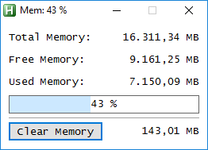

# AHK MemoryInfo
Shows info about memory via AutoHotkey

## Features
* Shows total, free & used memory in MB
* Shows used memory in percentage %
* Clear unused memory function

## Example

## Info
* [AHK Thread](https://autohotkey.com/boards/viewtopic.php?f=6&t=142)
* [GlobalMemoryStatusEx](https://msdn.microsoft.com/en-us/library/aa366589(v=vs.85).aspx)
* [SetProcessWorkingSetSize](https://msdn.microsoft.com/en-us/library/ms686234(v=vs.85).aspx)
* [EmptyWorkingSet](https://msdn.microsoft.com/en-us/library/ms682606(v=vs.85).aspx)
* [GetNumberFormat](https://msdn.microsoft.com/en-us/library/dd318110(v=vs.85).aspx)

## Contributing
* thanks to AutoHotkey Community

## Questions / Bugs / Issues
Report any bugs or issues on the [AHK Thread](https://autohotkey.com/boards/viewtopic.php?f=6&t=142). Same for any questions.

## Copyright and License
[Unlicense](LICENSE)

## Donations
[Donations are appreciated if I could help you](https://www.paypal.me/smithz)