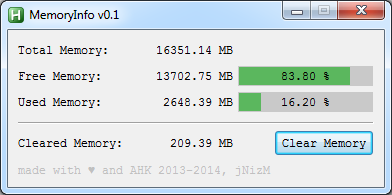

# MemoryInfo by jNizM
Shows info about memory via AutoHotkey

  
## Features
* Shows total, free & used memory in MB
* Shows used memory in percentage %
* Clear unused memory function

## Screenshot

## Info
* Version: v0.1
* URL: [AHK Thread](http://ahkscript.org/boards/viewtopic.php?f=6&t=142)

## Changelog
* 0.1 | First Release

## Contributing
* thanks to AutoHotkey Community

  
## Copyright and License
[WTFPL License](LICENSE)